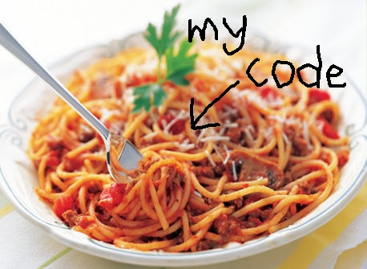

# Mastermind for node.js

## How to play

[Play in your browser](https://ninivert.github.io/mastermind/)\
_or_\
Open the `docs\index.html` page to have a nice interface\
_or_\
Run `node index.js` to play the game in the command line

## Rules

[Wikipedia is the best](https://en.wikipedia.org/wiki/Mastermind_(board_game))

## Todo

- Refactor the spaghetti code
- Maybe make things a bit prettier, but meh

